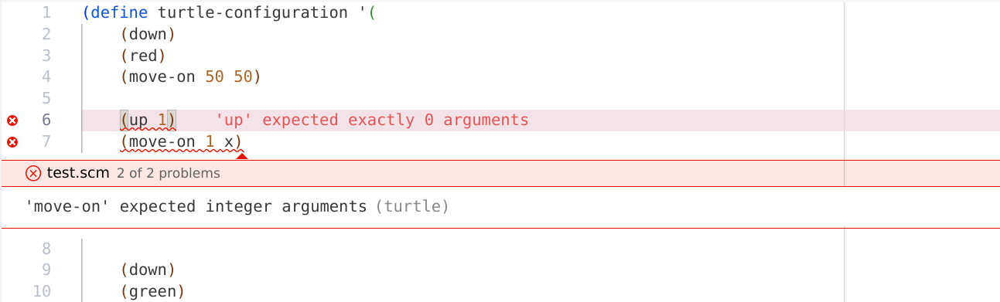

# Turtle support

## Description

Provides support for [Turtle configs][turtle].

[turtle]: https://github.com/EmilyGraceSeville7cf/tinyscheme-turtle?tab=readme-ov-file#configuration-script-commands

## Features

- [x] Completions for Turtle commands, and some basic Scheme constructs
- [x] RegExp-based completions for user-defined variables, functions, colors and vectors
- [x] RegExp-based warnings for incorrect RGB colors and wrong argument count for commands
